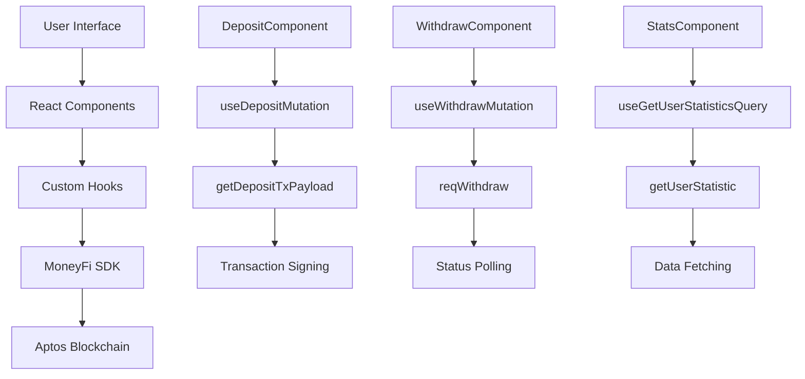
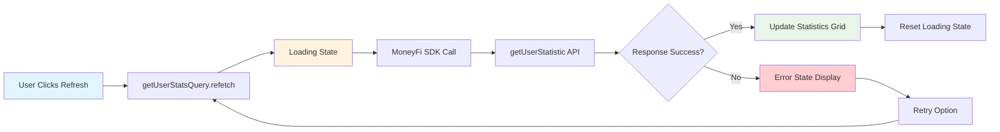
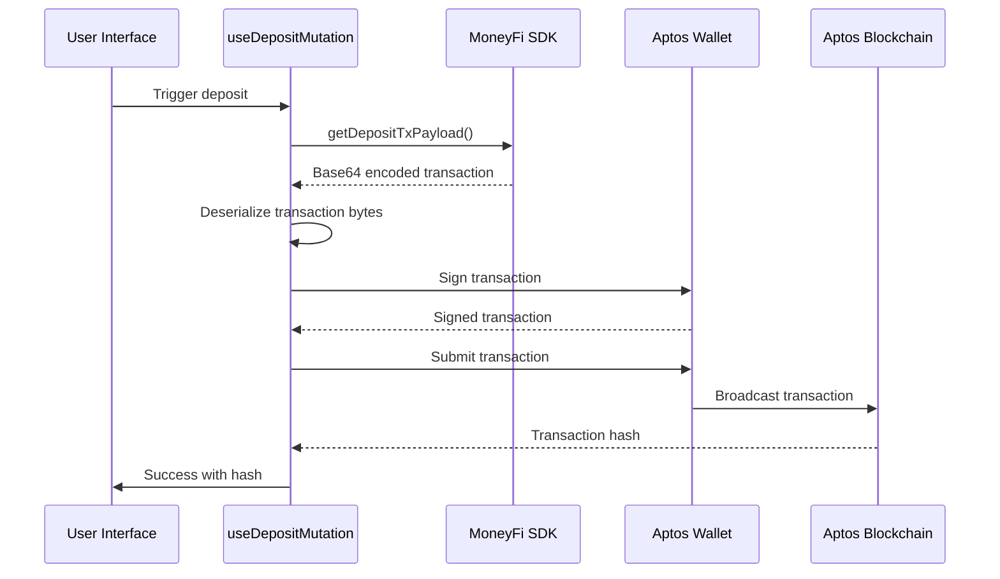
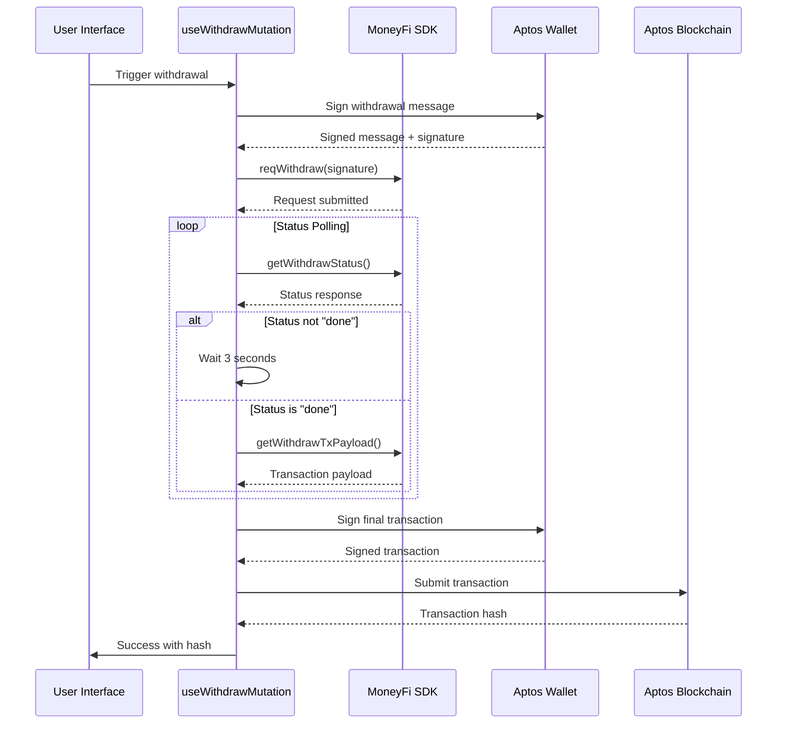

# MoneyFi SDK

A modern DeFi application SDK that enables users to interact with the MoneyFi protocol on the Aptos blockchain. MoneyFi is a DeFAI platform that helps non-DeFi users monetize stablecoins across protocols and blockchains through fully automated, AI-powered strategies.

## Table of Contents

- [Features](#features)
- [Getting Started](#getting-started)
- [Usage](#usage)
- [Transaction Flow Documentation](#transaction-flow-documentation)
  - [Deposit Flow Deep Dive](#deposit-flow-deep-dive)
  - [Withdraw Flow Deep Dive](#withdraw-flow-deep-dive)
  - [Statistics Flow Deep Dive](#statistics-flow-deep-dive)
- [Hook Architecture Documentation](#hook-architecture-documentation)
  - [useDepositMutation Implementation](#usedepositmutation-implementation)
  - [useWithdrawMutation Implementation](#usewithdrawmutation-implementation)
  - [useGetUserStatisticsQuery Implementation](#usegetuserstatisticsquery-implementation)
- [SDK Integration Patterns](#sdk-integration-patterns)
- [Contributing](#contributing)
- [License](#license)

## Features

- **Multi-Wallet Support**: Connect with popular Aptos wallets (Petra, OKX, Nightly, Pontem)
- **Multi-Token Support**: Deposit and withdraw both USDC and USDT seamlessly
- **Account Management**: Automated user account creation and partnership initialization
- **Real-time Statistics**: Comprehensive portfolio analytics with 8 key metrics
- **Dark/Light Theme**: Material Design 3 theming with automatic system preference detection
- **Transaction Monitoring**: Track transaction hashes with direct links to Aptos Explorer
- **Responsive Design**: Mobile-first interface built with modern UI components
- **Type-safe Development**: Full TypeScript support with comprehensive type definitions

## Getting Started

### Prerequisites

- Node.js 18+ and pnpm
- An Aptos wallet extension (Petra, OKX, etc.)

### Installation

1. Clone the repository:
```bash
git clone <repository-url>
cd moneyfi-sdk
```

2. Install dependencies:
```bash
pnpm install
```

3. Start the development server:
```bash
pnpm dev
```

The application will be available at `http://localhost:3000`.

### Environment Variables

Create a `.env` file in the root directory:

```env
VITE_APTOS_CLIENT_API_KEY=your_aptos_api_key_here
```

## Usage

### Connecting a Wallet

1. Click the "Connect Wallet" button in the header
2. Select your preferred Aptos wallet from the modal
3. Approve the connection in your wallet extension
4. Your wallet address will appear in the header once connected

### Depositing Funds

1. **Connect your wallet** using the wallet button in the header
2. **Select token type** from the dropdown (USDC or USDT)
3. **Enter deposit amount** in the amount field
4. **Click "Deposit"** - the system will automatically:
   - Create your MoneyFi user account (if needed)
   - Initialize your wallet account (if needed)
   - Execute the token deposit
5. **Track your transaction** via the provided Aptos Explorer link

### Withdrawing Funds

1. Locate the **"Withdraw Funds"** card on the dashboard
2. Click **"Withdraw All"** to initiate full withdrawal
3. **Confirm the transaction** in your wallet
4. **Monitor progress** via the transaction hash link to Aptos Explorer

---

## Transaction Flow Documentation

The MoneyFi SDK implements a sophisticated three-layer transaction processing architecture designed for seamless DeFi operations on the Aptos blockchain:

1. **Presentation Layer**: React components (`src/modules/dashboard/components/transaction/`)
2. **Hook Layer**: Custom React hooks with TanStack Query integration (`src/hooks/`)
3. **SDK Layer**: MoneyFi TypeScript SDK integration (`@moneyfi/ts-sdk`)

### Transaction Flow Architecture Diagram



### Deposit Flow Deep Dive

#### Multi-Step Deposit Workflow Architecture

The `DepositComponent` implements a sophisticated state machine with four distinct phases:

```typescript
type DepositState = "idle" | "creating-user" | "initializing-account" | "depositing";
```

#### Workflow Execution Sequence

```mermaid
flowchart LR
    A[User Input] --> B{Amount Valid?}
    B -->|No| A
    B -->|Yes| C[Creating User Phase]
    C --> D[useGetOrCreateUserMutation]
    D --> E{Has Wallet Account?}
    E -->|No| F[Initializing Account Phase]
    E -->|Yes| I[Depositing Phase]
    F --> G[checkOrCreateAptosAccount]
    G --> H[Multi-Agent Transaction]
    H --> I
    I --> J[useDepositMutation]
    J --> K[SDK Payload Generation]
    K --> L[Transaction Signing]
    L --> M[Blockchain Submission]
    M --> N[Query Invalidation]
    N --> O[Success State]

    style A fill:#e1f5fe
    style C fill:#fff3e0
    style F fill:#fce4ec
    style I fill:#e8f5e8
    style O fill:#e8f5e8
```



#### 1. User Input Validation

The deposit process begins with comprehensive input validation:

```typescript
// From deposit.tsx
const [amount, setAmount] = useState("");
const [selectedToken, setSelectedToken] = useState<"USDC" | "USDT">("USDC");

const tokenAddress = selectedToken === "USDC" ? APTOS_ADDRESS.USDC : APTOS_ADDRESS.USDT;

// Validation in handleDeposit
const handleDeposit = async () => {
  if (!amount || !user?.address) {
    return;
  }
  // Process continues...
};
```

#### 2. Creating User Phase

The system automatically creates a MoneyFi user account if it doesn't exist:

```typescript
// From deposit.tsx
setCurrentStep("creating-user");
await new Promise<any>((resolve, reject) => {
  createUserMutation.mutate(
    {
      address: user.address,
      refBy: undefined,
    },
    {
      onSuccess: async (data) => {
        // Invalidate user-related queries after successful user creation
        await queryClient.invalidateQueries({
          queryKey: ["user", user.address],
        });
        await queryClient.invalidateQueries({
          queryKey: ["userProfile"],
        });
        resolve(data);
      },
      onError: (error) => {
        reject(error);
      },
    }
  );
});
```

#### 3. Smart Account Management System

The most sophisticated part of the deposit flow is the multi-agent transaction system for account initialization:

```typescript
// From deposit.tsx - Multi-agent transaction construction
const checkOrCreateAptosAccount = async () => {
  const data = await initAccountMutation.mutate({ address: user.address });
  const signed_tx = data?.signed_tx;
  
  // Deserialize the signed transaction
  const txBytes = new Uint8Array(
    atob(signed_tx)
      .split("")
      .map((c) => c.charCodeAt(0))
  );
  const de = new Deserializer(txBytes);
  const tx = SignedTransaction.deserialize(de);
  
  // Extract operator authentication
  const operatorAuth = (
    tx.authenticator as TransactionAuthenticatorMultiAgent
  ).sender.bcsToBytes();
  
  // Construct multi-agent transaction with operator
  const operatorAddress = new AccountAddress(
    new Uint8Array(
      APTOS_CONFIG.OPERATOR_ADDRESS.match(/.{1,2}/g)?.map((byte) =>
        parseInt(byte, 16)
      ) || []
    )
  );
  const multiAgentTx = new MultiAgentTransaction(tx.raw_txn, [operatorAddress]);
  
  // Dual signature collection: User + Operator
  const feepayerAuthenticator = await aptosSignTransaction({
    transactionOrPayload: multiAgentTx,
  });
  
  const submitTx = await aptosSubmitTransaction({
    transaction: multiAgentTx,
    senderAuthenticator: feepayerAuthenticator.authenticator,
    additionalSignersAuthenticators: [
      AccountAuthenticator.deserialize(new Deserializer(operatorAuth)),
    ],
  });
};
```

#### 4. Deposit Execution Phase

The final phase uses the MoneyFi SDK to generate and submit the deposit transaction:

```typescript
// From deposit.tsx
setCurrentStep("depositing");
await depositMutation.mutate(
  { amount, tokenAddress },
  {
    onSuccess: async (data) => {
      // Comprehensive query invalidation strategy
      queryClient.invalidateQueries({
        queryKey: moneyFiQueryKeys.balance(user.address),
      });
      queryClient.invalidateQueries({
        queryKey: ["transactions", user.address],
      });
      queryClient.invalidateQueries({
        queryKey: statsQueryKeys.user(user.address),
      });
      
      setAmount("");
      setSuccessData({ hash: data.hash });
      setCurrentStep("idle");
    }
  }
);
```

#### Error Handling and Recovery Mechanisms

The deposit flow implements comprehensive error handling:

- **Atomic Operations**: Each step completes entirely or rolls back completely
- **State Consistency**: UI state automatically synchronizes with transaction state
- **User Feedback**: Real-time progress indicators with specific error messages
- **Retry Capability**: Users can restart the process without data corruption

```typescript
// From deposit.tsx - Comprehensive error handling
{(stepError ||
  depositMutation.isError ||
  createUserMutation.isError ||
  initAccountMutation.isError) && (
  <Alert.Root status="error">
    <Alert.Description>
      <Text color="error.800">
        {stepError ||
          (depositMutation.error instanceof Error
            ? depositMutation.error.message
            : "Deposit failed")}
      </Text>
    </Alert.Description>
  </Alert.Root>
)}
```

### Withdraw Component Deep Dive

#### Signature-Based Withdrawal Architecture

The `WithdrawComponent` implements a sophisticated cryptographic signature system supporting both Ed25519 and Keyless signature schemes.

#### Withdrawal Process Flow

```mermaid
flowchart LR
    A[User Input] --> B[Portfolio Validation]
    B --> C[Amount Validation]
    C --> D[Message Construction]
    D --> E[Signature Creation]
    E --> F{Signature Type?}
    F -->|Ed25519| G[Ed25519 Signature]
    F -->|Keyless| H[Keyless Signature]
    G --> I[Payload Transformation]
    H --> I
    I --> J[SDK reqWithdraw]
    J --> K[Status Polling Loop]
    K --> L{Status Done?}
    L -->|No| M[Wait 3s]
    M --> K
    L -->|Yes| N[Transaction Payload Generation]
    N --> O[Transaction Signing]
    O --> P[Blockchain Submission]
    P --> Q[Success State]

    style A fill:#e1f5fe
    style D fill:#fff3e0
    style F fill:#fce4ec
    style K fill:#ffeb3b
    style Q fill:#e8f5e8
```



#### 1. Portfolio Validation System

The withdraw component includes real-time portfolio validation:

```typescript
// From withdraw.tsx - Portfolio validation
const { data: userStats } = useGetUserStatisticsQuery(user?.address);

// Validation logic
const maxWithdrawAmount = userStats?.total_value ? Number(userStats.total_value) : 0;
const currentAmount = amount ? parseFloat(amount) : 0;
const isAmountExceeded = currentAmount > maxWithdrawAmount;
const isAmountValid = currentAmount > 0 && !isAmountExceeded;

const handleMaxAmount = () => {
  if (userStats?.total_value) {
    setAmount(userStats.total_value.toString());
  }
};
```

#### 2. Message Construction and Serialization

Withdrawal messages are constructed with deterministic serialization:

```typescript
// From withdraw.tsx - Message construction
const handleWithdraw = async () => {
  const amountNum = parseFloat(amount.toString());
  const nonce = Math.random().toString(36).substring(2, 15);
  
  const message = {
    amount: amountNum,
    target_chain_id: -1, // Aptos mainnet identifier
    token_address: selectedToken === "USDC" ? APTOS_ADDRESS.USDC : APTOS_ADDRESS.USDT,
  };

  const messageSerialized = JSON.stringify(message);
  const withdrawSignature = await aptosSignMessage({
    message: messageSerialized,
    nonce,
  });
};
```

#### 3. Multi-Signature Support System

The component automatically detects and handles different signature types:

```typescript
// From withdraw.tsx - Multi-signature support
const isWalletFromEd25519 = isEd25519(aptosAccount?.publicKey.toString());

if (!isWalletFromEd25519) {
  // Keyless signature construction
  const encodedKeylessPubkey = new KeylessPublicKey(
    (aptosAccount?.publicKey as any).publicKey.iss,
    (aptosAccount?.publicKey as any).publicKey.idCommitment
  );

  const encodedKeylessSignature = new KeylessSignature({
    ...(withdrawSignature.signature as any).signature,
  });

  payload = {
    encoded_signature: encodedKeylessSignature.toString(),
    encoded_pubkey: encodedKeylessPubkey.toString(),
    full_message: withdrawSignature.fullMessage.toString(),
  };
} else {
  // Ed25519 signature construction
  payload = {
    encoded_signature: withdrawSignature.signature.toString(),
    encoded_pubkey: aptosAccount.publicKey.toString(),
    full_message: withdrawSignature.fullMessage.toString(),
  };
}
```

#### 4. Asynchronous Status Polling

The withdrawal process implements sophisticated status polling with automatic transaction execution:

```typescript
// From use-moneyfi-queries.ts - Status polling implementation
const pollWithdrawStatus = async (): Promise<any> => {
  while (true) {
    const statusResponse = await moneyFiAptos.getWithdrawStatus(user.address);

    if ((statusResponse as any) === "done" || (statusResponse as any)?.status === "done") {
      const txPayload = await moneyFiAptos.getWithdrawTxPayload({
        sender: user.address,
        chain_id: -1,
        token_address: tokenAddress,
        amount: amount as bigint,
      });
      return { withdrawResponse: statusResponse, txPayload };
    }

    // 3-second polling interval for optimal balance between responsiveness and API load
    await new Promise((resolve) => setTimeout(resolve, 3000));
  }
};
```

#### Dynamic UI Feedback

The withdrawal interface provides comprehensive user feedback:

```typescript
// From withdraw.tsx - Dynamic validation UI
<Input
  type="number"
  value={amount}
  onChange={(e) => setAmount(e.target.value)}
  borderColor={isAmountExceeded ? "error.500" : cardColors.border}
  _focus={{
    borderColor: isAmountExceeded ? "error.500" : "primary.500",
    boxShadow: isAmountExceeded
      ? `0 0 0 2px error.200`
      : `0 0 0 2px primary.200`,
  }}
/>
{isAmountExceeded && (
  <Text color="error.600">
    Amount cannot exceed your total portfolio value of $
    {maxWithdrawAmount.toLocaleString()}
  </Text>
)}
```

### Statistics Flow Deep Dive

#### Portfolio Analytics Architecture

The `StatsComponent` provides comprehensive portfolio analytics with 8 key metrics, implementing a sophisticated data presentation system with real-time refresh capabilities.

#### Statistics Configuration System

The component uses a configuration-driven approach for displaying metrics:

```typescript
// From stats.tsx - Statistics configuration
const statsConfig = [
  {
    key: "total_value",
    label: "Total Portfolio Value",
    icon: BiDollar,
    formatter: formatCurrency,
    color: "success.600",
    bgColor: "success.50",
    borderColor: "success.200",
  },
  {
    key: "idle_asset_value",
    label: "Idle Assets",
    icon: BiWallet,
    formatter: formatCurrency,
    color: "neutral.600",
    bgColor: "neutral.50",
    borderColor: "neutral.200",
  },
  {
    key: "total_deposited_liquidity",
    label: "Total Deposited",
    icon: BiDownArrowCircle,
    formatter: formatCurrency,
    color: "primary.600",
    bgColor: "primary.50",
    borderColor: "primary.200",
  },
  // ... 5 more statistics configurations
];
```

#### Data Formatting Utilities

The component implements utility functions for consistent data presentation:

```typescript
// From stats.tsx - Utility functions
const formatCurrency = (value: number): string => {
  if (value === 0) return "$0.00";
  if (value >= 1000000) {
    return `$${(value / 1000000).toFixed(2)}M`;
  }
  if (value >= 1000) {
    return `$${(value / 1000).toFixed(2)}K`;
  }
  return `$${value.toFixed(2)}`;
};

const formatPercentage = (value: number): string => {
  return `${value.toFixed(2)}%`;
};
```

#### Statistics Refresh Flow



#### Real-Time Statistics Display

The component renders statistics using a responsive grid system:

```typescript
// From stats.tsx - Statistics grid rendering
{getUserStatsQuery.isSuccess && getUserStatsQuery.data && (
  <SimpleGrid columns={{ base: 1, md: 2, lg: 3, xl: 4 }} gap={4}>
    {statsConfig.map((stat) => {
      const IconComponent = stat.icon;
      const value = getUserStatsQuery.data[stat.key as keyof typeof getUserStatsQuery.data] || 0;
      const formattedValue = stat.formatter(Number(value));

      return (
        <Card.Root
          key={stat.key}
          bg={cardColors.background}
          border="1px solid"
          borderColor={stat.borderColor}
          borderRadius={materialDesign3Theme.borderRadius.md}
          p={6}
          transition="all 0.3s cubic-bezier(0.4, 0, 0.2, 1)"
          _hover={{
            boxShadow: materialDesign3Theme.elevation.level2,
            transform: "translateY(-2px)",
          }}
        >
          {/* Card content with icon, label, and formatted value */}
        </Card.Root>
      );
    })}
  </SimpleGrid>
)}
```

#### Loading and Error States

The statistics component implements comprehensive state management:

```typescript
// From stats.tsx - Loading state
{getUserStatsQuery.isPending && (
  <Box display="flex" flexDirection="column" alignItems="center" p={8}>
    <Spinner size="xl" color="primary.500" borderWidth="4px" />
    <Text mt={4} color={cardColors.textSecondary}>
      Loading your statistics...
    </Text>
  </Box>
)}

// Error state with retry functionality
{getUserStatsQuery.isError && (
  <Alert.Root status="error">
    <Alert.Description>
      <VStack align="stretch" gap={3}>
        <Text color="error.800" fontWeight="medium">
          Failed to load statistics
        </Text>
        <Text color="error.700" fontSize="sm">
          {getUserStatsQuery.error instanceof Error
            ? getUserStatsQuery.error.message
            : "An unknown error occurred while fetching your portfolio statistics."}
        </Text>
        <Button onClick={handleRefreshStats} size="sm" colorScheme="error" variant="outline">
          Try Again
        </Button>
      </VStack>
    </Alert.Description>
  </Alert.Root>
)}
```

#### Manual Refresh Functionality

Users can manually refresh their statistics with instant feedback:

```typescript
// From stats.tsx - Manual refresh implementation
const handleRefreshStats = () => {
  getUserStatsQuery.refetch();
};

<Button
  onClick={handleRefreshStats}
  loading={getUserStatsQuery.isFetching}
  disabled={getUserStatsQuery.isFetching}
>
  {getUserStatsQuery.isFetching ? "Refreshing..." : "Refresh Statistics"}
</Button>
```

---

## Hook Architecture Documentation

The MoneyFi SDK implements a sophisticated hook-based architecture using TanStack Query for optimal state management, caching, and synchronization with the Aptos blockchain.

### useDelayedBalanceRefetch Pattern

A core architectural pattern that implements optimistic updates with blockchain confirmation:

```typescript
// From use-moneyfi-queries.ts - Delayed refetch configuration
export const BALANCE_REFETCH_CONFIG = {
  immediate: 0,        // Immediate optimistic refetch
  delayed: 4000,       // 4 seconds delayed refetch for blockchain confirmation
  staleTime: 30_000,   // 30 seconds
  gcTime: 5 * 60 * 1000, // 5 minutes
} as const;

export const useDelayedBalanceRefetch = () => {
  const queryClient = useQueryClient();
  const { user } = useAuth();
  const timeoutRef = useRef<NodeJS.Timeout | null>(null);

  const triggerDelayedRefetch = useCallback(async (options = { immediate: true, delayed: true }) => {
    const queryKey = moneyFiQueryKeys.balance(user?.address);

    // Clear any existing timeout to prevent multiple delayed refetches
    if (timeoutRef.current) {
      clearTimeout(timeoutRef.current);
      timeoutRef.current = null;
    }

    try {
      // Immediate optimistic refetch for UI responsiveness
      if (options.immediate) {
        await queryClient.refetchQueries({ queryKey, type: "active" });
      }

      // Schedule delayed refetch for blockchain confirmation
      if (options.delayed) {
        timeoutRef.current = setTimeout(async () => {
          try {
            await queryClient.refetchQueries({ queryKey, type: "active" });
          } catch (error) {
            console.error("Delayed balance refetch failed:", error);
          }
          timeoutRef.current = null;
        }, BALANCE_REFETCH_CONFIG.delayed);
      }
    } catch (error) {
      console.error("Immediate balance refetch failed:", error);
    }
  }, [queryClient, user?.address]);

  // Cleanup timeout on unmount
  const cleanup = useCallback(() => {
    if (timeoutRef.current) {
      clearTimeout(timeoutRef.current);
      timeoutRef.current = null;
    }
  }, []);

  return { triggerDelayedRefetch, cleanup };
};
```

### useDepositMutation Implementation

Advanced mutation hook with sophisticated transaction processing:

```typescript
// From use-moneyfi-queries.ts - Deposit mutation implementation
export const useDepositMutation = ({ tokenAddress, sender: userAddress, amount }: DepositMutationParams) => {
  const { isAuthenticated, user } = useAuth();
  const { signTransaction, submitTransaction } = useWallet();
  const { triggerDelayedRefetch, cleanup } = useDelayedBalanceRefetch();
  
  const moneyFiAptos = new MoneyFi([
    {
      chain_id: -1,
      custom_rpc_url: "https://api.mainnet.aptoslabs.com/v1",
    },
  ]);

  React.useEffect(() => {
    return cleanup;
  }, [cleanup]);

  return useMutation({
    mutationFn: async ({ amount, tokenAddress }: { amount: string; tokenAddress: string }) => {
      if (!isAuthenticated || !user) {
        throw new Error("Please connect your wallet first");
      }

      if (!amount || isNaN(Number(amount)) || Number(amount) <= 0) {
        throw new Error("Please enter a valid amount");
      }

      const amountInSmallestUnit = BigInt(Math.floor(Number(amount) * 1_000_000));

      // SDK payload generation
      const payload = await moneyFiAptos.getDepositTxPayload({
        sender: userAddress,
        chain_id: -1,
        token_address: tokenAddress,
        amount: amountInSmallestUnit,
      });

      // Base64 decoding with manual byte conversion
      const binaryString = atob(payload.tx);
      const bytes = new Uint8Array(binaryString.length);
      for (let i = 0; i < binaryString.length; i++) {
        bytes[i] = binaryString.charCodeAt(i);
      }

      // Transaction deserialization and execution
      const de = new Deserializer(bytes);
      const depositTx = RawTransaction.deserialize(de);
      const depoistTxSimple = new SimpleTransaction(depositTx);
      
      const submitTx = await signTransaction({
        transactionOrPayload: depoistTxSimple,
      });
      
      const rst = await submitTransaction({
        transaction: depoistTxSimple,
        senderAuthenticator: submitTx.authenticator,
      });

      return rst;
    },

    onSuccess: async (data) => {
      await triggerDelayedRefetch({
        immediate: true,
        delayed: true,
      });
    },
    
    onError: (error) => {
      console.error("Deposit transaction failed:", error);
      cleanup();
    },
    
    retry: false,
  });
};
```

### useWithdrawMutation Implementation

Sophisticated withdrawal mutation with status polling:

```typescript
// From use-moneyfi-queries.ts - Withdraw mutation with polling
export const useWithdrawMutation = (tokenAddress: string, amount: BigInt) => {
  const { isAuthenticated, user } = useAuth();
  const { account: aptosAccount } = useWallet();
  const { triggerDelayedRefetch, cleanup } = useDelayedBalanceRefetch();
  
  const moneyFiAptos = new MoneyFi([
    { chain_id: -1, custom_rpc_url: "https://api.mainnet.aptoslabs.com/v1" },
  ]);
  
  const { signTransaction, submitTransaction } = useWallet();

  React.useEffect(() => {
    return cleanup;
  }, [cleanup]);

  return useMutation({
    mutationFn: async ({ address, payload }: {
      address: string;
      payload: { encoded_signature: string; encoded_pubkey: string; full_message: string; };
    }) => {
      if (!isAuthenticated || !user || !aptosAccount) {
        throw new Error("Please connect your wallet first");
      }

      // Transform payload to match MoneyFi SDK requirements
      const transformedPayload = {
        signature: payload.encoded_signature,
        pubkey: payload.encoded_pubkey,
        message: payload.full_message,
      };
      
      const response = await moneyFiAptos.reqWithdraw(address, transformedPayload);

      // Asynchronous status polling with infinite loop
      const pollWithdrawStatus = async (): Promise<any> => {
        while (true) {
          const statusResponse = await moneyFiAptos.getWithdrawStatus(user.address);

          if ((statusResponse as any) === "done" || (statusResponse as any)?.status === "done") {
            const txPayload = await moneyFiAptos.getWithdrawTxPayload({
              sender: user.address,
              chain_id: -1,
              token_address: tokenAddress,
              amount: amount as bigint,
            });
            return { withdrawResponse: statusResponse, txPayload };
          }

          // 3-second polling interval for optimal balance between responsiveness and API load
          await new Promise((resolve) => setTimeout(resolve, 3000));
        }
      };

      return await pollWithdrawStatus();
    },
    
    onSuccess: async (data) => {
      const { txPayload } = data;

      // Base64 decoding and transaction execution
      const binaryString = atob(txPayload.tx);
      const bytes = new Uint8Array(binaryString.length);
      for (let i = 0; i < binaryString.length; i++) {
        bytes[i] = binaryString.charCodeAt(i);
      }

      const de = new Deserializer(bytes);
      const withdrawTx = RawTransaction.deserialize(de);
      const withdrawTxSimple = new SimpleTransaction(withdrawTx);

      const submitTx = await signTransaction({
        transactionOrPayload: withdrawTxSimple,
      });
      
      const rst = await submitTransaction({
        transaction: withdrawTxSimple,
        senderAuthenticator: submitTx.authenticator,
      });

      await triggerDelayedRefetch({
        immediate: true,
        delayed: true,
      });

      return rst;
    },
    
    onError: (error) => {
      console.error("Withdraw transaction failed:", error);
      cleanup();
    },
    
    retry: false,
  });
};
```

### useGetUserStatisticsQuery Implementation

Optimized query hook for portfolio statistics:

```typescript
// From use-stats.ts - Statistics query implementation
export const statsQueryKeys = {
  all: ["stats"] as const,
  user: (address?: string) => [...statsQueryKeys.all, "user", address] as const,
};

export const useGetUserStatisticsQuery = (address?: string) => {
  const { isAuthenticated, user } = useAuth();
  const moneyFiAptos = new MoneyFi([
    {
      chain_id: -1,
      custom_rpc_url: "https://api.mainnet.aptoslabs.com/v1"
    }
  ]);

  return useQuery({
    queryKey: statsQueryKeys.user(address),
    queryFn: async () => {
      if (!isAuthenticated || !user) {
        throw new Error("Please connect your wallet first");
      }

      if (!address) {
        throw new Error("Address is required");
      }

      try {
        const stats = await moneyFiAptos.getUserStatistic({
          address, 
          chain_id: -1
        });
        return stats;
      } catch (error) {
        console.error("Error fetching user statistics:", error);
        throw error;
      }
    },
    enabled: !!(isAuthenticated && user && address),
    staleTime: 60_000,        // 60 seconds
    gcTime: 5 * 60 * 1000,    // 5 minutes
    retry: 10,                // Aggressive retry for important user data
  });
};
```

---

## SDK Integration Patterns

### MoneyFi SDK Instantiation

The MoneyFi SDK is consistently instantiated across all hooks with the Aptos mainnet configuration:

```typescript
// Standard SDK instantiation pattern used across all hooks
const moneyFiAptos = new MoneyFi([
  {
    chain_id: -1, // Aptos mainnet identifier
    custom_rpc_url: "https://api.mainnet.aptoslabs.com/v1"
  }
]);
```

### Transaction Lifecycle Patterns

#### 1. Deposit Transaction Flow



#### 2. Withdrawal Transaction Flow



### Query Management and Caching Strategy

#### Query Key Patterns

The SDK implements a hierarchical query key system for optimal cache management:

```typescript
// From use-moneyfi-queries.ts
export const moneyFiQueryKeys = {
  all: ["moneyfi"] as const,
  balance: (address?: string) => [...moneyFiQueryKeys.all, "balance", address] as const,
  balanceRefreshing: (address?: string) => [...moneyFiQueryKeys.balance(address), "refreshing"] as const,
};

// From use-stats.ts
export const statsQueryKeys = {
  all: ["stats"] as const,
  user: (address?: string) => [...statsQueryKeys.all, "user", address] as const,
};
```

#### Cache Invalidation Strategy

The SDK implements strategic cache invalidation to maintain data consistency:

```typescript
// Comprehensive invalidation after successful deposit
await queryClient.invalidateQueries({
  queryKey: moneyFiQueryKeys.balance(user.address),
});
await queryClient.invalidateQueries({
  queryKey: ["transactions", user.address],
});
await queryClient.invalidateQueries({
  queryKey: statsQueryKeys.user(user.address),
});
```

### Error Handling Patterns

#### Centralized Error Management

All hooks implement consistent error handling patterns:

```typescript
// Standard error handling in mutations
onError: (error) => {
  console.error("Transaction failed:", error);
  cleanup();
},
retry: false, // Disable automatic retries for transactions

// Query error handling with retry logic
retry: 10, // Aggressive retry for data fetching
```

#### User-Friendly Error Messages

Errors are transformed into user-friendly messages:

```typescript
// From deposit.tsx - Error message transformation
{stepError ||
  (depositMutation.error instanceof Error
    ? depositMutation.error.message
    : depositMutation.isError
    ? "Deposit failed"
    : "An unknown error occurred")}
```

### Performance Optimization Patterns

#### Optimistic Updates

The SDK implements optimistic updates for better user experience:

```typescript
// Immediate UI update followed by delayed blockchain confirmation
await triggerDelayedRefetch({
  immediate: true,  // Instant UI feedback
  delayed: true,    // Blockchain confirmation after 4 seconds
});
```

#### Memory Management

Proper cleanup patterns prevent memory leaks:

```typescript
// Cleanup pattern used in all mutation hooks
React.useEffect(() => {
  return cleanup;
}, [cleanup]);
```

### Development Best Practices

#### Type Safety

All hooks maintain strict TypeScript typing:

```typescript
interface DepositMutationParams {
  tokenAddress: string;
  sender: string;
  amount: BigInt;
}

type CreateWithdrawRequestPayload = {
  encoded_signature: string;
  encoded_pubkey: string;
  full_message: string;
};
```

#### Configuration Management

Consistent configuration patterns across the application:

```typescript
export const BALANCE_REFETCH_CONFIG = {
  immediate: 0,
  delayed: 4000,
  staleTime: 30_000,
  gcTime: 5 * 60 * 1000,
} as const;
```

## Contributing

1. Fork the repository
2. Create a feature branch (`git checkout -b feature/amazing-feature`)
3. Make your changes
4. Run the pre-commit checks (`pnpm pre-commit`)
5. Commit your changes (`git commit -m 'Add amazing feature'`)
6. Push to the branch (`git push origin feature/amazing-feature`)
7. Open a Pull Request

## License

This project is private and proprietary to MoneyFi.

## Support

For questions and support, please contact the MoneyFi development team.
